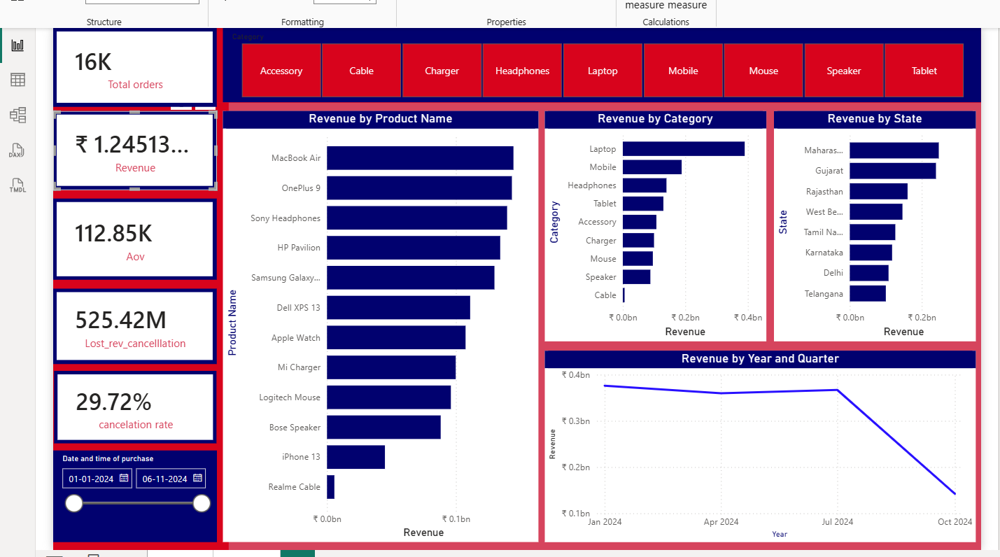
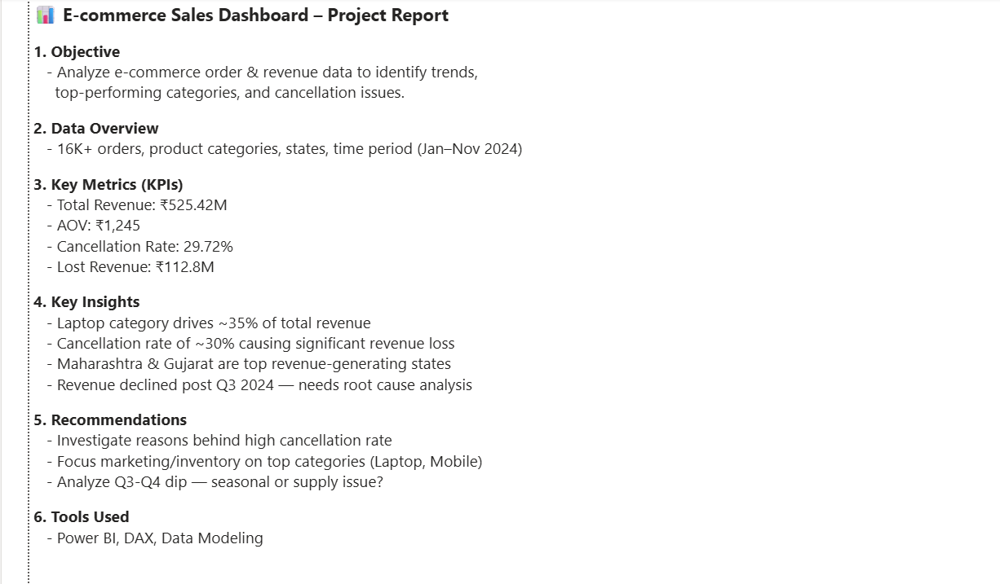

# ecommerce-sales-dashboard
Power BI dashboard analyzing e-commerce sales, revenue &amp; cancellation trends.

📊 E-commerce Sales Dashboard – Project Report

1. Objective
   - Analyze e-commerce order & revenue data to identify trends, 
     top-performing categories, and cancellation issues.

2. Data Overview
   - 16K+ orders, product categories, states, time period (Jan–Nov 2024)

3. Key Metrics (KPIs)
   - Total Revenue: ₹525.42M
   - AOV: ₹1,245
   - Cancellation Rate: 29.72%
   - Lost Revenue: ₹112.8M

4. Key Insights
   - Laptop category drives ~35% of total revenue
   - Cancellation rate of ~30% causing significant revenue loss
   - Maharashtra & Gujarat are top revenue-generating states
   - Revenue declined post Q3 2024 — needs root cause analysis

5. Recommendations
   - Investigate reasons behind high cancellation rate
   - Focus marketing/inventory on top categories (Laptop, Mobile)
   - Analyze Q3-Q4 dip — seasonal or supply issue?

6. Tools Used
   - Power BI, DAX, Data Modeling
  

## Dashboard Preview

